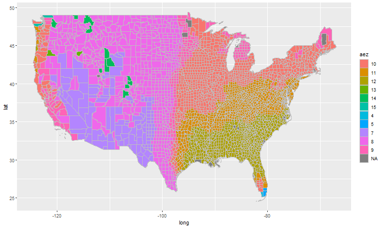

## Description of the repository

The problem I solve in this repository is how to identify which U.S. counties belong to each Agro-ecological Zone [AEZ](https://www.ifpri.org/publication/agro-ecological-zones-africa). The importance of this problem relies on academic and research spheres for the most part.

The following is a quick description of the codes:

In `assets` you should find two U.S. shapefiles for states and counties respectively, they are cropped to only include the continental U.S. `assets\GTAEZ_v10` includes the AEZ shapefile at the global level.

I first use `code/USmap_AEZ18shp_creation.R` to crop down the global datasets into US datasets such as the one right below. You can find the output [here](output/USmap_AEZ18). I have not found a shapefile of the AEZ zones online, so you're welcome.

`code/AEZ18_to_UScnty_fips_creation.R` performs the last part of the job. It uses the county shapefile and the newly create AEZ shapefile for the U.S. to create a key that connects fips to AEZ. You can find the output [here](output/AEZ18_to_UScnty_fips.csv). To avoid the problem that a county may belong to more than one AEZ, I use county polygon's mass centroids intersecting with AEZ polygon's shape. Therefore, each U.S. county belongs to a AEZ. This is, indeed, an assumption to simplify the work.

## AEZ18 in U.S. counties projejection

Above I showed you how the AEZ look across the U.S. states. Right below, I show you how the US counties look across the U.S. states. The next picture is a projection that I aim to achieve with polygons' shapes rather than border lines. The last picture is how the final product looks like. 

The first most noticeable complications are the NA. My method seems to left-out a handful of counties. But most importantly, the method seems to be good at classifying the counties East of the 100th Meridian. The most significant differences are in the Northern part of New England. In fact, the differences seem to arise from using the intersection of points to polygons. This problem is more noticeable on the Western part of the US where where there is a lot more of AEZ diversity.

