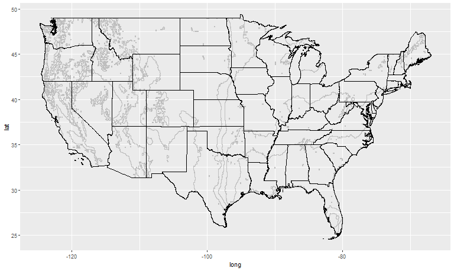
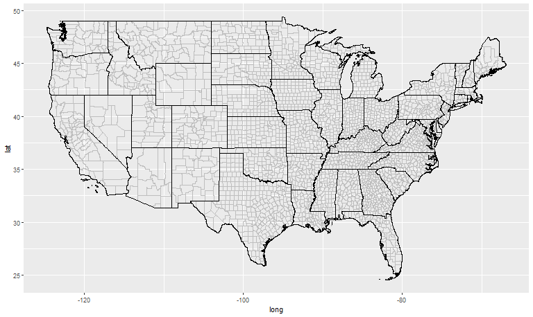
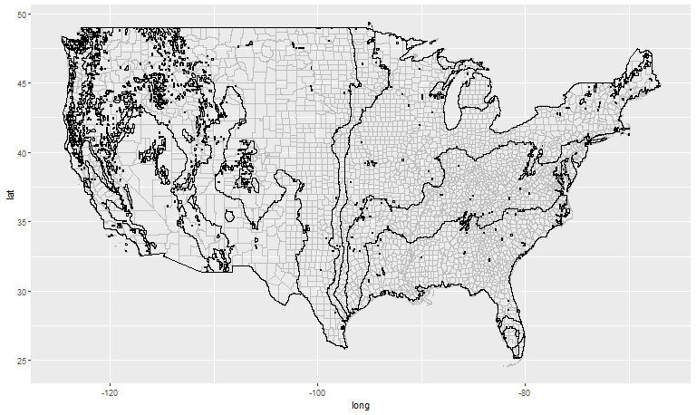
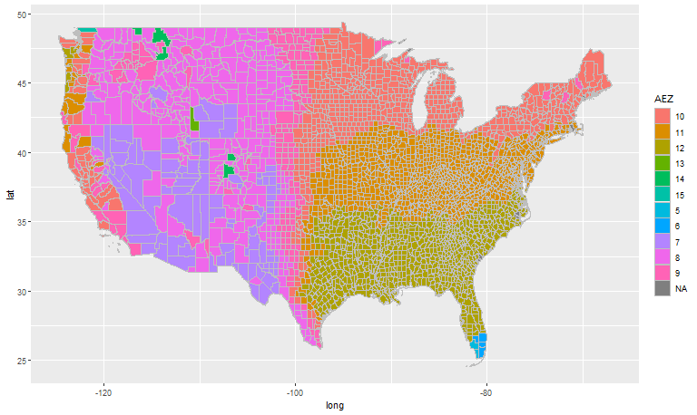
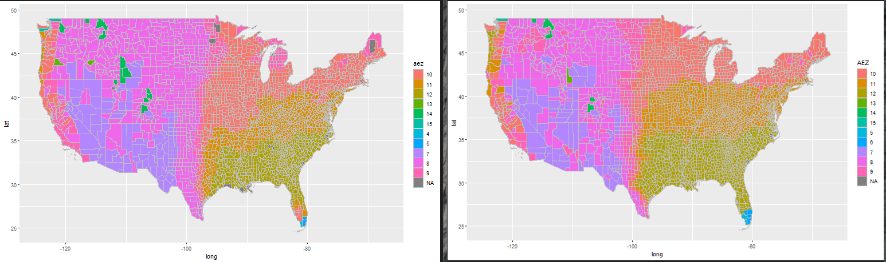

## Description of the repository

**Note (GTAP version 11)**: GTAP version 11 arrived, Uris Baldos (Purdue's GTAP team) provided us with the newest AEZ shapefile that will be associated with GTAP version 11. The change in the AEZ creation comes with two changes, which is likely what drives the differences that are shown below. The AEZ v3 was updated into the AEZ v4 with (1) changes in methodology that can be observed in the table below (**bolded**), and (2) methodology by shifting the scope of the data from 1961-1990 in the AEZ v3 to 2000-2010 in the AEZ v4. See the references below for a thorough discussion

| GTAP Label | AEZ v3    | AEZ v4    |Label         |

|------------|---------|--------|-------------------|

| LGP1       | 0-59    |0-59    |hyper-arid and arid|

| LGP2       | 60-119  |60-119  |dry semi-arid      |

| LGP3       | 120-179 |120-179 |moist semi-arid    |

| LGP4       |**180-239** |**180-269**|**sub-humid**|

| LGP5       |**240-299** |**270-364**|**humid**    |

| LGP6       |**300+**    |**365**    |**per-humid**|

The problem I solve in this repository is how to identify which U.S. counties belong to each Agro-ecological Zone [AEZ](https://www.ifpri.org/publication/agro-ecological-zones-africa). The importance of this problem relies on academic and research spheres for the most part.

If using this shapefile, please cite:

Nava, N J, J Beckman, and M Ivanic. 2023. "Estimating the Market Implications from Climate-induced Corn and Soybean Yield Changes for the U.S." *Forthcoming as Economics Research Report*

The following is a quick description of the codes:

In `assets` you should find two U.S. shapefiles for states and counties respectively, they are cropped to only include the continental U.S. `assets\GTAEZ_v10` includes the AEZ shapefile at the global level.

I first use `code/USmap_AEZ18shp_creation.R` to crop down the global datasets into US datasets such as the one right below. You can find the output [here](output/USmap_AEZ18). I have not found a shapefile of the AEZ zones online, so you're welcome.

`code/AEZ18_to_UScnty_fips_creation.R` performs the last part of the job. It uses the county shapefile and the newly create AEZ shapefile for the U.S. to create a key that connects fips to AEZ. You can find the output [here](output/AEZ18_to_UScnty_fips.csv). To avoid the problem that a county may belong to more than one AEZ, I use county polygon's mass centroids intersecting with AEZ polygon's shape. Therefore, each U.S. county belongs to a AEZ. This is, indeed, an assumption to simplify the work.

## AEZ18 in U.S. counties projejection

Above I showed you how the AEZ look across the U.S. states. Right below, I show you how the US counties look across the U.S. states. The next picture is a projection that I aim to achieve with polygons' shapes rather than border lines. The last picture is how the final product looks like.

The first most noticeable complications are the NA. My method seems to left-out a handful of counties. But most importantly, the method seems to be good at classifying the counties East of the 100th Meridian. The most significant differences are in the Northern part of New England. In fact, the differences seem to arise from using the intersection of points to polygons. This problem is more noticeable on the Western part of the US where where there is a lot more of AEZ diversity.

**Changes in AEZs from moving from GTAP v10 to v11 (moving from AEZ v3 to AEZ v4)**

Here, left map is version 10 (AEZ v3) and right map is version 11 (AEZ v4). You can notice that in almost any part of the map, we can see changes in the AEZ that will indeed affect how counties are mapped into the AEZ.

*References:*

G. Fischer, Global Agro-Ecological Zones v4 – Model documentation (FAO, 2021) https:/doi.org/10.4060/cb4744en (November 22, 2022).

FAO/IIASA, 2011-2012. Global Agro-ecological Zones (GAEZ v3.0)  FAO Rome, Italy and IIASA, Laxenburg, Austria
